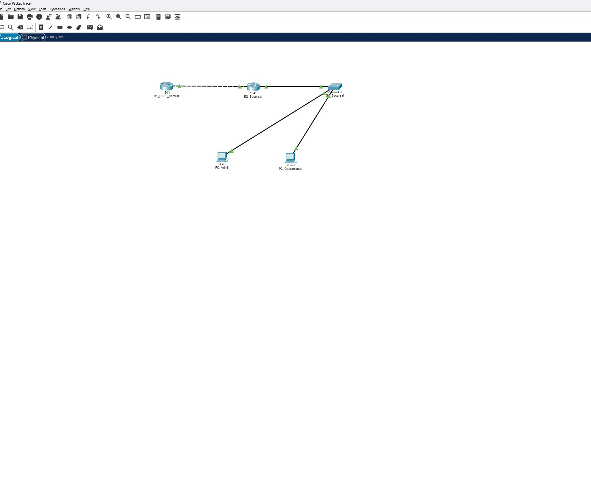
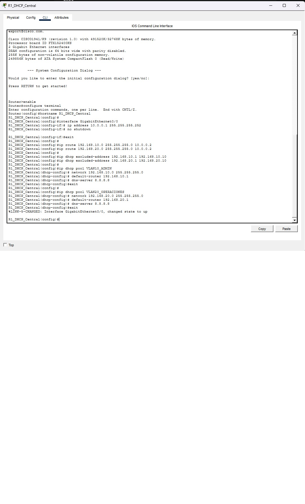
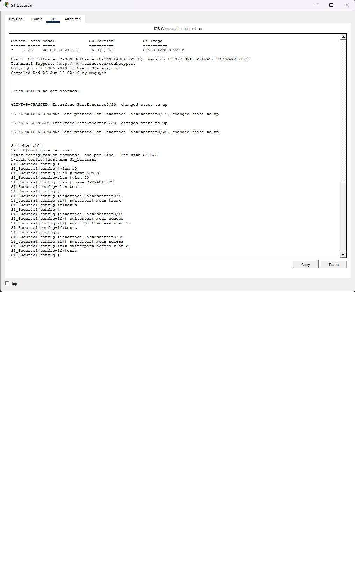
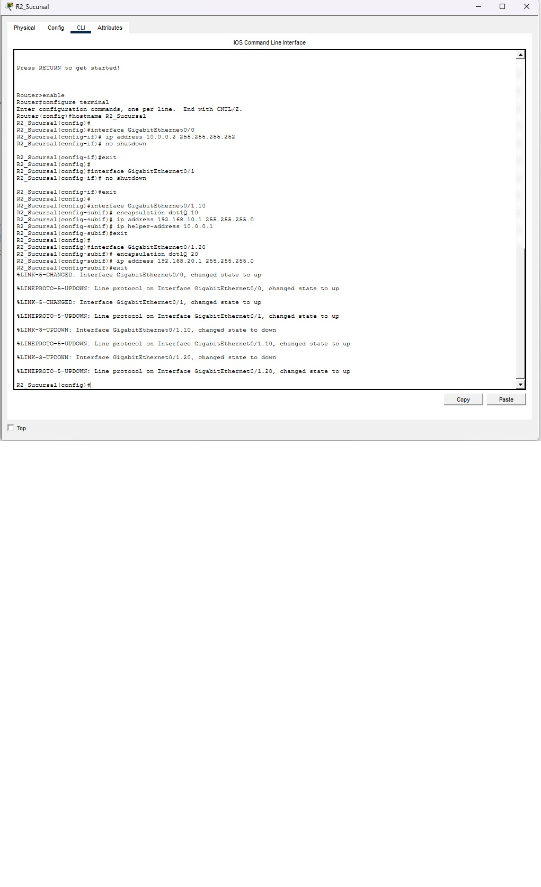
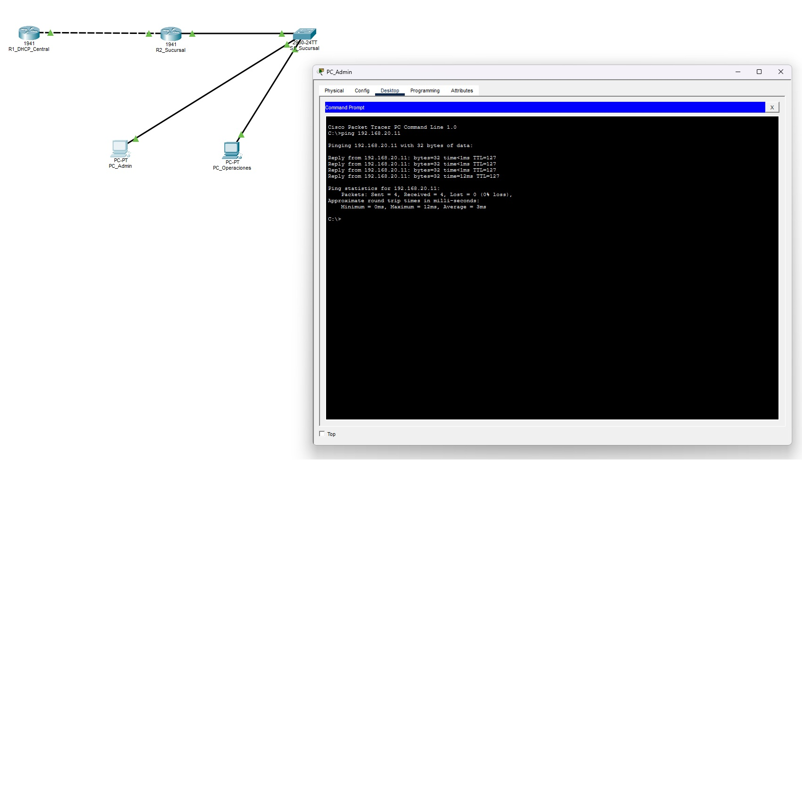
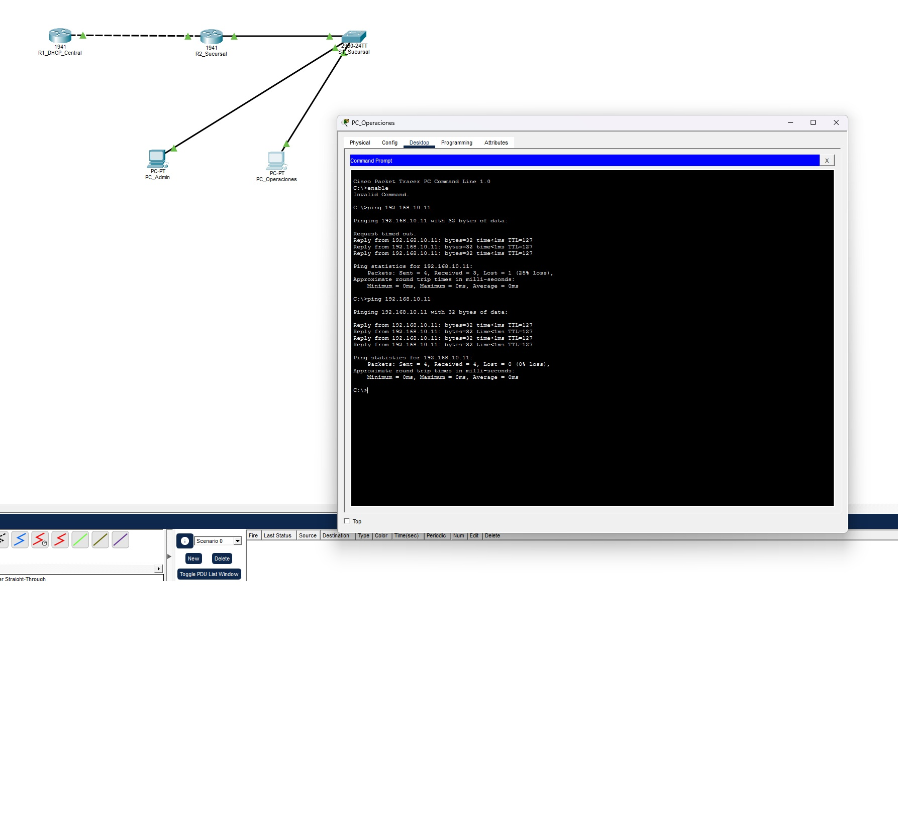

# troubleshooting-roas-dhcp-relay

# 🛠️ Resolución de Incidentes (Troubleshooting): Inter-VLAN Routing (ROAS) y DHCP Relay Agent

## 📋 Contexto y Ticket de Soporte (Gestión de Incidentes)
* **ID del Ticket:** INC-84092
* **Prioridad:** Alta (Afectación operativa en Sucursal)
* **Escalamiento:** El ticket fue escalado por el equipo de Soporte Nivel 1 (HelpDesk) al área de Ingeniería de Redes. El N1 verificó que los cables físicos estuvieran conectados y reinició los equipos finales sin éxito.
* **Descripción del Incidente:** Los usuarios del departamento de Operaciones (VLAN 20) reportan pérdida total de conectividad a la red local e internet. El departamento de Administración (VLAN 10), ubicado en la misma sucursal, opera con total normalidad.
* **Síntomas Iniciales:** Las PCs de Operaciones no logran contactar al Servidor DHCP Central, recibiendo por defecto un direccionamiento de falla APIPA (`169.254.x.x`).

---

## 🗺️ Arquitectura y Topología de Red
La infraestructura consta de un **Servidor DHCP Central (R1)** conectado mediante un enlace WAN a un **Router de Sucursal (R2)**. Este último utiliza la técnica **Router-on-a-Stick (ROAS)** para enrutar el tráfico de las VLANs 10 y 20 que provienen del **Switch de Acceso (S1)**.



*(Nota: Configuración base del Servidor DHCP Central)*


---

## 🔍 Metodología de Diagnóstico (Troubleshooting Paso a Paso)

Para aislar el problema y encontrar la causa raíz (Root Cause), se aplicó un enfoque deductivo de abajo hacia arriba (*Bottom-Up*), siguiendo el Modelo OSI.

### Paso 1: Verificación de Capa 2 (Switching y VLANs)
Primero se descartó una mala configuración en los puertos de acceso o en el enlace troncal del switch de la sucursal.
* **Comando:** `S1_Sucursal# show vlan brief`
* **Comando:** `S1_Sucursal# show interfaces trunk`



* **Conclusión Nivel 2:** La capa de Switching funciona sin errores. Los puertos están en las VLANs correctas y el enlace troncal opera en modo 802.1Q. El problema reside en el enrutamiento.

### Paso 2: Verificación de Capa 3 (Inter-VLAN Routing)
Dado que el Servidor DHCP está en una red remota, el Router 2 debe actuar como agente de retransmisión (*DHCP Relay Agent*). Se inspeccionaron las subinterfaces lógicas:
* **Comando:** `R2_Sucursal# show running-config`

**⚠️ Hallazgo (Root Cause Analysis):**
Al revisar la subinterfaz `GigabitEthernet0/1.20` (Gateway de la VLAN 20), se detectó la ausencia crítica del comando `ip helper-address`. 
Al no estar este parámetro, el router frena por defecto los paquetes *Broadcast* (peticiones DHCP) de la PC de Operaciones, impidiendo que lleguen a la IP del Servidor Central (`10.0.0.1`). 



---

## 🛠️ Resolución del Incidente

Se inyectó el parámetro faltante en la subinterfaz afectada del router de la sucursal, habilitando el reenvío de las peticiones DHCP en formato *Unicast* hacia el servidor central.

**Comandos de mitigación aplicados:**
```text
R2_Sucursal> enable
R2_Sucursal# configure terminal
R2_Sucursal(config)# interface GigabitEthernet0/1.20
R2_Sucursal(config-subif)# ip helper-address 10.0.0.1
R2_Sucursal(config-subif)# end
R2_Sucursal# write memory
```

✅ Verificación y Pruebas Post-Resolución
Una vez aplicado el parche de configuración, se validó la mitigación del incidente directamente desde el equipo del usuario final.

1. Obtención de Direccionamiento (DHCP Request)
Se forzó una renovación de la interfaz de red en la PC_Operaciones. El equipo logró comunicarse exitosamente con el Servidor DHCP remoto, abandonando la IP APIPA y recibiendo los parámetros correctos de su segmento (192.168.20.11).

[📸 PC-Admin " con la IP 192.168.20.11]


2. Conectividad End-to-End (ICMP Ping)
Se comprobó la estabilidad del enrutamiento ROAS enviando paquetes ICMP hacia una PC de otra red (VLAN 10). La tabla ARP resolvió la dirección y los paquetes llegaron con un 0% de pérdida.

[📸 PC-Operaciones " con la IP 192.168.20.11]: Captura de la ventana del Command Prompt mostrando el segundo ping exitoso (Sent = 4, Received = 4, Lost = 0)]

Estado del Ticket: CERRADO Y DOCUMENTADO 🟢

------------------------------
💻 TÍTULO Y ENCABEZADO
TÍTULO PRINCIPAL: TROUBLESHOOTING: ROAS & DHCP RELAY
Subtítulo: Diagnóstico y resolución de fallas de asignación IP en redes divididas por VLANs utilizando un servidor centralizado.

🖧 SECCIÓN: TOPOLOGÍA (Datos para los recuadros)
R1 (DHCP Central): G0/0 -> 10.0.0.1/30

R2 (Router ROAS): G0/0 -> 10.0.0.2/30

VLAN 10 (Admin): 192.168.10.0/24 (Gateway: 192.168.10.1)

VLAN 20 (Oper): 192.168.20.0/24 (Gateway: 192.168.20.1) - ¡Falla APIPA!

1️⃣ RECUADRO 1: DIAGNÓSTICO (CAUSA RAÍZ)
Título: 1. IDENTIFICAR FALLA LÓGICA
Texto/Código:

Verificar subinterfaces en router de sucursal:
R2> enable
R2# show running-config

! Hallazgo en G0/1.20: 
! Ausencia de configuración DHCP Relay.
! Los paquetes Broadcast son descartados.

2️⃣ RECUADRO 2: APLICAR SOLUCIÓN (IP HELPER)
Título: 2. CONFIGURAR AGENTE RELAY
Texto/Código:

R2# configure terminal
R2(config)# interface g0/1.20
R2(config-subif)# ip helper-address 10.0.0.1
R2(config-subif)# end
R2# write memory

R2# configure terminal
R2(config)# interface g0/1.20
R2(config-subif)# ip helper-address 10.0.0.1
R2(config-subif)# end
R2# write memory

3️⃣ RECUADRO 3: SOLICITAR IP (RENOVACIÓN)
Título: 3. RENOVAR IP EN EL CLIENTE
Texto:

En PC_Operaciones (VLAN 20):

Desktop > IP Configuration > Static > DHCP

Resultado esperado: El equipo abandona la IP APIPA (169.254.x.x) y muestra DHCP request successful con la IP 192.168.20.11.

4️⃣ RECUADRO 4: VERIFICAR CONECTIVIDAD
Título: 4. PRUEBA DE ENRUTAMIENTO (ROAS)
Texto/Código:

PC_Operaciones> ping 192.168.10.11

Resultado esperado:
4 paquetes enviados, 4 recibidos, 0% loss.
(Comunicación Inter-VLAN exitosa).

⚠️ RECUADRO ROJO: ERRORES COMUNES
❌ Olvidar el comando ip helper-address al usar servidores DHCP remotos.

❌ No configurar el puerto del switch que conecta al router en modo Troncal (switchport mode trunk).

❌ Asignar un ID de VLAN incorrecto en el comando encapsulation dot1Q.

✅ RECUADRO VERDE: ¿QUÉ APRENDÍ?
✔️ Aplicar Troubleshooting estructurado (Bottom-Up).

✔️ Configurar un Agente DHCP Relay para redes remotas.

✔️ Implementar enrutamiento Inter-VLAN (Router-on-a-Stick).

✔️ Diagnosticar e interpretar direccionamientos de falla (APIPA).

🏷️ FOOTER (Igual al anterior)
M MarceloNH-IT | 🐱 github.com/MarceloNH-IT


🤝 Conclusión y Contacto 🤝

<p align="center">
  
</p>
🤝 Conclusión y Contacto 🤝


* **💼 LinkedIn**: [Horacio Marcelo Nuñez](https://linkedin.com) 
* **📬 Correo Electrónico**: [marcelonh86@gmail.com](marcelonh86@gmail.com)
* **🚀 GitHub**: [@MarceloNunez-NOC](https://github.com/MarceloNunez-NOC)

---

## 🎯 Conclusión y Proyección Profesional

Agradezco el tiempo de quienes visitan este repositorio. Este proyecto forma parte de mi camino de formación continua en **Python, redes y administración de sistemas**, diseñado para demostrar que puedo estructurar código limpio, documentar procesos y resolver problemas lógicos con un enfoque metódico.

Mi objetivo como profesional de IT es aportar valor mediante el diagnóstico preciso, la automatización de tareas y la documentación clara de incidentes. Los scripts que comparto reflejan mi capacidad de evolucionar desde la lógica básica hacia la resolución de escenarios complejos.

Invito a reclutadores, colegas y referentes del sector a explorar mis repositorios, donde continuo integrando herramientas de redes, infraestructura y programación. Estoy abierto a colaborar y aportar mi experiencia en entornos tecnológicos que valoren la constancia, el orden y la resolución analítica de problemas.
